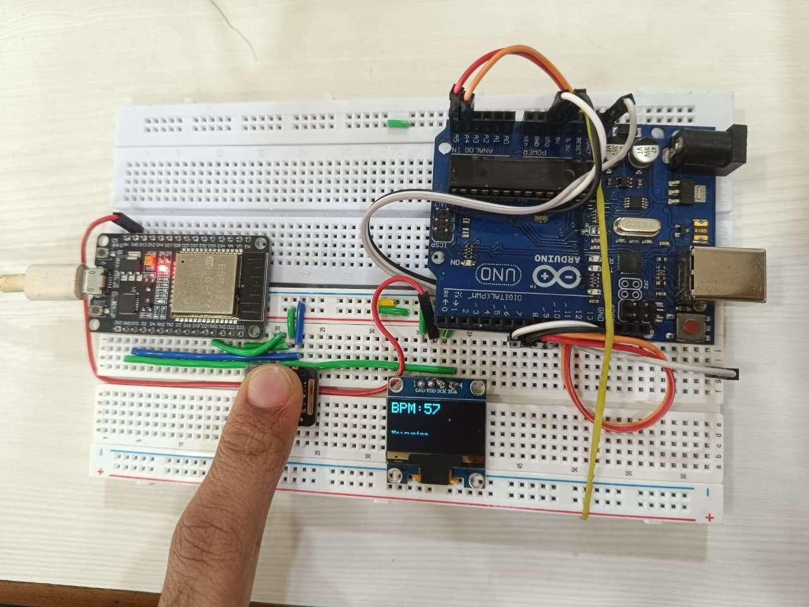
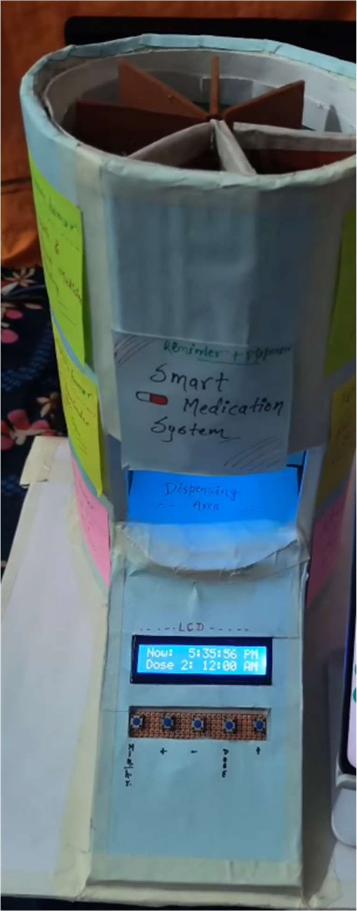
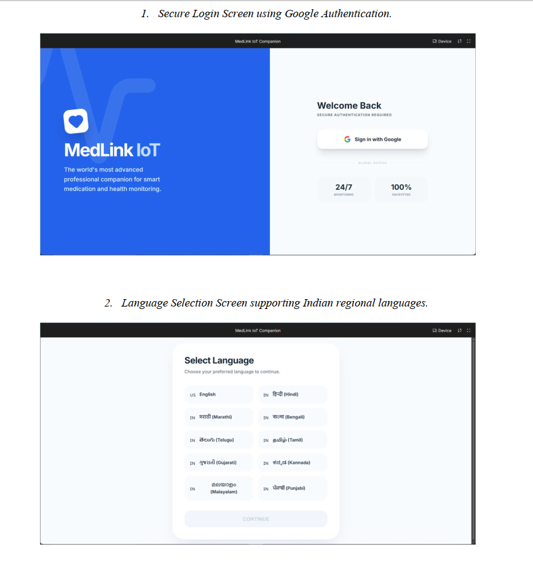
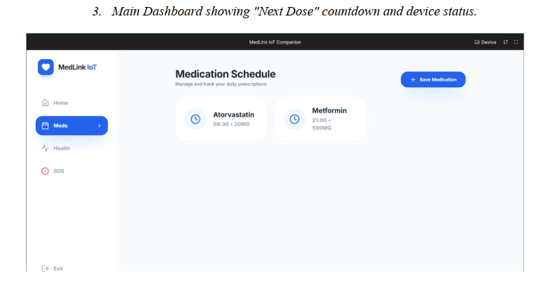
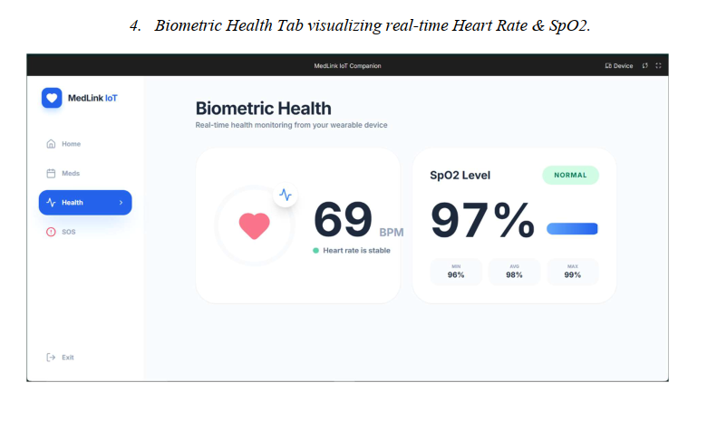
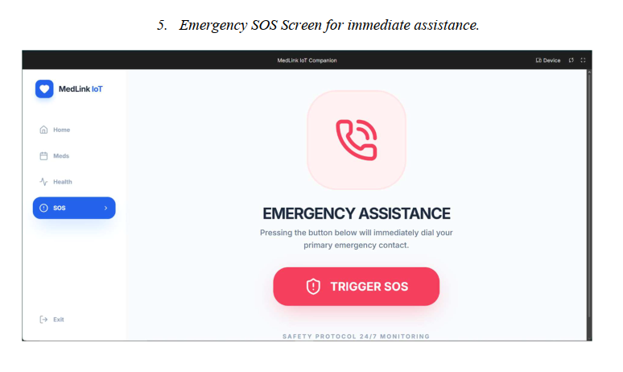

# MedLink IoT — Smart Pillbox & Vital Health Monitoring

**Your Smart Pal for Meds & Monitoring!**

An IoT-based automated pill dispenser that helps patients — especially the elderly and those with chronic illnesses — take their medication on time, while letting caregivers monitor adherence and vital health parameters remotely.

---

## 📋 Table of Contents
- [Problem Statement](#problem-statement)
- [Features](#features)
- [System Architecture](#system-architecture)
- [Hardware Components](#hardware-components)
- [Software Stack](#software-stack)
- [Mechanical Design](#mechanical-design)
- [Screenshots](#screenshots)
- [Getting Started](#getting-started)
- [Team](#team)
- [Future Scope](#future-scope)
- [References](#references)

---

## Problem Statement

According to the World Health Organization, nearly **50% of patients** do not take their medicines as prescribed. This is especially critical for:
- **Elderly patients** with memory-related conditions (e.g., Alzheimer's)
- **Chronic illness patients** (diabetes, hypertension, etc.)
- **Caregivers** who have no way to remotely verify medication adherence

Traditional pillboxes rely entirely on human memory and offer no confirmation or monitoring.

## Features

- 🔄 **Automated Dispensing** — Revolver-style mechanism drops the right pill at the right time
- ⏱️ **Precise Timing** — RTC-based scheduling accurate to within 2 minutes
- 📶 **IoT Connectivity** — ESP32-powered Wi-Fi communication with cloud dashboard
- ❤️ **Vital Health Monitoring** — Real-time Heart Rate & SpO2 via MAX30102 sensor
- 📱 **Companion Web App** — "MedLink IoT Companion" PWA for scheduling & monitoring
- 🌐 **Multi-language Support** — Includes Hindi, Marathi, and other Indian regional languages
- 🚨 **Emergency SOS** — One-touch button for immediate emergency assistance
- 🔔 **Smart Alerts** — OLED display + buzzer + RGB LED status indicators

## System Architecture

The system follows a **three-layer architecture**:

| Layer | Description |
|---|---|
| **Input Layer** | MedLink IoT App, push buttons, Wi-Fi |
| **Processing Layer (ESP32)** | Logic processing, Wi-Fi communication, servo control |
| **Output Layer** | Servo motor, OLED display, RGB LED, buzzer alerts |

## Hardware Components

| Component | Function |
|---|---|
| Arduino Uno | Primary microcontroller — interfaces with sensors & motors |
| ESP32 Module | Handles Wi-Fi connectivity & cloud communication |
| MAX30102 Pulse Sensor | Measures real-time Heart Rate (BPM) & SpO2 |
| IR Obstacle Sensor | Confirms physical pill dispensing |
| SG90 Servo Motor | Rotates the revolver drum to dispense pills |
| OLED Display (0.96") | Displays time, status, and alerts |

## Software Stack

- **Frontend:** React.js (Vite) + Tailwind CSS
- **Icons:** Lucide React
- **Backend:** Google Firebase (auth + real-time database)
- **Firmware:** C++ (Arduino IDE)
- **Libraries used:** `BlynkSimpleEsp32.h`, `RTClib.h`, `Servo.h`, `Adafruit_SSD1306.h`, `MAX30105.h`

## Mechanical Design

A **revolver-style dispensing mechanism**:
1. 3D-printed cylindrical outer casing with a single drop hole
2. Internal 8-compartment rotating drum (like pie slices)
3. Servo motor rotates the drum 45° at a time to align each compartment
4. Gravity drops the pill once aligned
5. IR sensor confirms the pill has fallen
   
## Hardware Setup

| Circuit Interfacing & Sensor Testing | Final Assembled Prototype |
|---|---|
|  |  |

## Screenshots

| Login | Dashboard | Biometric Health | SOS |
|---|---|---|---|
|  |  |  |  |

## Getting Started

### Firmware (Arduino/ESP32)
1. Open `firmware/MedLink_Firmware.ino` in Arduino IDE
2. Install required libraries: `Adafruit_GFX`, `Adafruit_SSD1306`, `MAX30105`, `Servo`, `RTClib`
3. Select your board (Arduino Uno / ESP32) and upload

### Web App
```bash
cd webapp
npm install
npm run dev
```

## Team

**E&TC - A, TCET | Group 51–55**

| Roll No. | Name |
|---|---|
| 51 | Siddhi Mahajan |
| 52 | Vedant Mali |
| 53 | Shourya Mall |
| 54 | Krishna Maurya |
| 55 | Rudra Mayekar |

**Guide:** Pooja Sarode, Assistant Professor, ES&H, TCET

## Future Scope

- 📷 **Camera Integration** — visual confirmation of pill intake
- 🔒 **Biometric Security** — fingerprint authentication
- 👥 **Multi-User Support** — multiple patient schedules (e.g., care homes)
- 🏥 **EHR Integration** — link with Electronic Health Records

## References

1. World Health Organization – Medication Adherence Reports
2. ESP32 Technical Reference Manual
3. Blynk IoT Platform Documentation
4. Arduino Official Documentation

---

*A Mini Internship Project — A.Y. 2025-26 — Department of Engineering Sciences and Humanities, TCET (University of Mumbai)*
